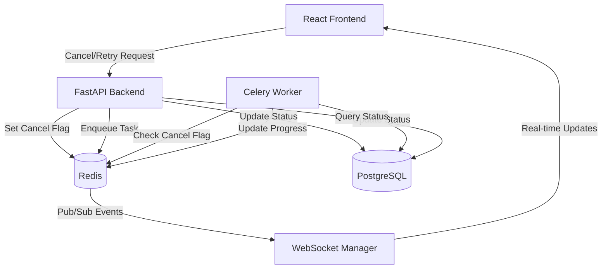
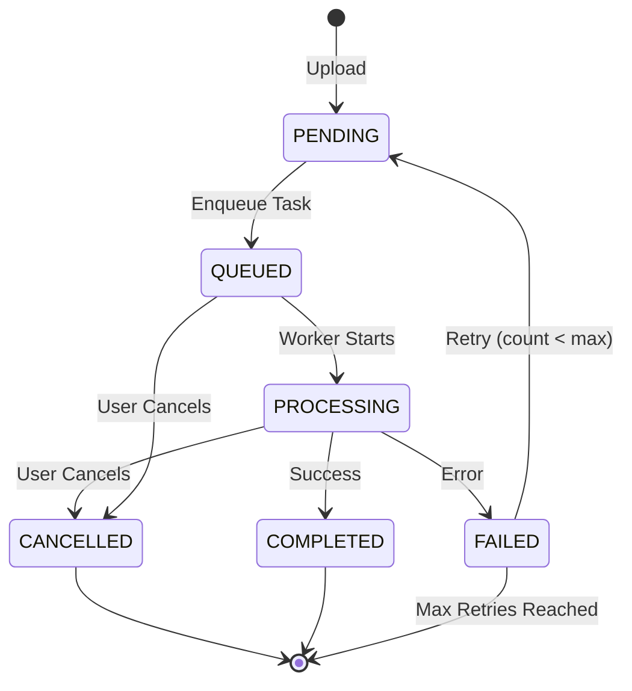

# Design Document: Document Processing Controls

## Overview

This feature adds cancel and retry controls to the document processing system, enabling users to stop in-progress processing tasks and retry failed documents. The implementation leverages Redis for cancellation signaling and pub/sub for real-time UI updates, while maintaining data consistency through careful state management in PostgreSQL.

The system follows a distributed architecture where:
- FastAPI backend provides REST endpoints for control operations
- Celery workers execute long-running document processing tasks
- Redis serves as both a message broker and a cancellation flag store
- WebSocket connections deliver real-time status updates to the frontend
- PostgreSQL maintains authoritative state for documents and jobs

Key design principles:
- Graceful cancellation: Workers check cancellation flags at safe points
- Idempotent operations: Multiple cancel/retry requests are handled safely
- State consistency: Database updates are atomic and properly sequenced
- User feedback: Real-time updates via WebSocket and pub/sub

## Architecture

### System Components



### Control Flow

#### Cancellation Flow
1. User clicks stop button in UI
2. Frontend sends POST to `/api/v1/documents/{id}/cancel`
3. Backend validates ownership and status
4. Backend sets Redis key `job:cancel:{job_id}` with 1-hour TTL
5. Backend updates job status to CANCELLED in database
6. Backend publishes cancellation event via Redis pub/sub
7. Worker detects cancellation flag at next checkpoint
8. Worker stops processing, cleans up resources
9. Worker updates document status to CANCELLED
10. Frontend receives WebSocket event and updates UI

#### Retry Flow
1. User clicks retry button in UI for failed document
2. Frontend sends POST to `/api/v1/documents/{id}/retry`
3. Backend validates ownership, status, and retry count
4. Backend verifies original file still exists
5. Backend deletes existing ProcessedData record
6. Backend resets document status to PENDING
7. Backend updates job: increments retryCount, clears error, sets status to PENDING
8. Backend enqueues new Celery task with original file path
9. Backend updates job with new celeryTaskId
10. Worker begins processing as normal
11. Frontend receives WebSocket event and updates UI

### State Transitions



## Components and Interfaces

### Backend API Endpoints

#### POST /api/v1/documents/{document_id}/cancel

Cancels a document that is currently processing or queued.

**Request:**
- Path parameter: `document_id` (string, UUID)
- Headers: `Authorization: Bearer <token>`

**Response (200 OK):**
```json
{
  "id": "uuid",
  "status": "CANCELLED",
  "message": "Document processing cancelled successfully"
}
```

**Error Responses:**
- 403 Forbidden: User does not own document
- 404 Not Found: Document does not exist
- 400 Bad Request: Document is not in a cancellable state (not PROCESSING or QUEUED)

**Implementation:**
```python
async def cancel_document(document_id: str, user_id: str):
    # Validate ownership
    document = await get_document_with_ownership_check(document_id, user_id)
    
    # Validate status
    if document.status not in ["PROCESSING", "QUEUED"]:
        raise ValidationError("Document is not in a cancellable state")
    
    # Set cancellation flag in Redis
    await redis_client.set(f"job:cancel:{document.job.id}", "1", ex=3600)
    
    # Update database
    await update_job_status(document.job.id, "CANCELLED")
    await update_document_status(document_id, "CANCELLED")
    
    # Publish event
    await redis_client.publish(f"progress:{document.job.id}", {
        "type": "job_cancelled",
        "jobId": document.job.id,
        "timestamp": time.time()
    })
    
    return document
```

#### POST /api/v1/documents/{document_id}/retry

Retries processing for a failed document.

**Request:**
- Path parameter: `document_id` (string, UUID)
- Headers: `Authorization: Bearer <token>`

**Response (200 OK):**
```json
{
  "id": "uuid",
  "status": "PENDING",
  "job": {
    "id": "uuid",
    "celeryTaskId": "uuid",
    "status": "PENDING",
    "retryCount": 1
  },
  "message": "Document queued for retry"
}
```

**Error Responses:**
- 403 Forbidden: User does not own document
- 404 Not Found: Document does not exist
- 400 Bad Request: Document status is not FAILED
- 400 Bad Request: Maximum retry attempts exceeded
- 400 Bad Request: Original file not found

**Implementation:**
```python
async def retry_document(document_id: str, user_id: str):
    # Validate ownership
    document = await get_document_with_ownership_check(document_id, user_id)
    
    # Validate status
    if document.status != "FAILED":
        raise ValidationError("Only failed documents can be retried")
    
    # Check retry limit
    if document.job.retryCount >= document.job.maxRetries:
        raise ValidationError("Maximum retry attempts exceeded")
    
    # Verify file exists
    if not await storage_service.file_exists(document.filePath):
        raise ValidationError("Original file not found, please re-upload")
    
    # Delete existing processed data
    if document.processedData:
        await db.processeddata.delete(where={"id": document.processedData.id})
    
    # Update job
    await db.job.update(
        where={"id": document.job.id},
        data={
            "status": "PENDING",
            "retryCount": document.job.retryCount + 1,
            "errorMessage": None,
            "failedAt": None
        }
    )
    
    # Update document
    await update_document_status(document_id, "PENDING")
    
    # Enqueue new task
    task_result = process_document_task.delay(
        document_id=document_id,
        file_path=document.filePath
    )
    
    # Update job with new task ID
    await db.job.update(
        where={"id": document.job.id},
        data={"celeryTaskId": task_result.id}
    )
    
    return document
```

### Worker Cancellation Checks

The Celery worker must check for cancellation at strategic points during processing:

**Checkpoint Locations:**
1. Before parsing starts
2. After parsing completes, before extraction
3. After extraction completes, before storing results

**Implementation:**
```python
async def check_cancellation(job_id: str) -> bool:
    """Check if job has been cancelled"""
    cancel_flag = await redis_client.get(f"job:cancel:{job_id}")
    return cancel_flag is not None

async def mark_job_cancelled(db, job_id: str, document_id: str):
    """Mark job and document as cancelled"""
    # Check if already cancelled (idempotency)
    job = await db.job.find_unique(where={"id": job_id})
    if job.status == "CANCELLED":
        return
    
    await db.job.update(
        where={"id": job_id},
        data={"status": "CANCELLED"}
    )
    await db.document.update(
        where={"id": document_id},
        data={"status": "CANCELLED"}
    )
    await publish_progress(db, job_id, "job_cancelled", "Job was cancelled by user", 0)
```

**Modified Worker Task:**
```python
async def process_document_async(task: Task, document_id: str, file_path: str):
    db = get_prisma()
    await db.connect()
    
    try:
        document = await db.document.find_unique(
            where={"id": document_id},
            include={"job": True}
        )
        
        job_id = document.job.id
        
        # Checkpoint 1: Before parsing
        if await check_cancellation(job_id):
            await mark_job_cancelled(db, job_id, document_id)
            return {"status": "cancelled"}
        
        # Parsing stage
        await publish_progress(db, job_id, "parsing_started", "Parsing document", 10)
        processor = get_processor_for_file(document.fileType)
        parsed_data = await processor.parse(file_path)
        await publish_progress(db, job_id, "parsing_completed", "Document parsed", 40)
        
        # Checkpoint 2: Before extraction
        if await check_cancellation(job_id):
            await mark_job_cancelled(db, job_id, document_id)
            return {"status": "cancelled"}
        
        # Extraction stage
        await publish_progress(db, job_id, "extraction_started", "Extracting data", 50)
        extracted_data = await processor.extract_structured_data(parsed_data)
        await publish_progress(db, job_id, "extraction_completed", "Extraction complete", 90)
        
        # Checkpoint 3: Before storing
        if await check_cancellation(job_id):
            await mark_job_cancelled(db, job_id, document_id)
            return {"status": "cancelled"}
        
        # Store results
        await db.processeddata.create(data={...})
        await update_job_status(db, job_id, "COMPLETED", completed=True)
        await update_document_status(db, document_id, "COMPLETED")
        
        return {"status": "completed"}
        
    finally:
        await db.disconnect()
```

### Frontend UI Components

#### Action Buttons Component

```typescript
interface ActionButtonsProps {
  document: Document;
  onCancel: (id: string) => Promise<void>;
  onRetry: (id: string) => Promise<void>;
}

function ActionButtons({ document, onCancel, onRetry }: ActionButtonsProps) {
  const [loading, setLoading] = useState(false);
  const [error, setError] = useState<string | null>(null);
  
  const handleCancel = async () => {
    setLoading(true);
    setError(null);
    try {
      await onCancel(document.id);
      // Success notification handled by parent
    } catch (err) {
      setError(err.message);
    } finally {
      setLoading(false);
    }
  };
  
  const handleRetry = async () => {
    setLoading(true);
    setError(null);
    try {
      await onRetry(document.id);
      // Success notification handled by parent
    } catch (err) {
      setError(err.message);
    } finally {
      setLoading(false);
    }
  };
  
  // Show stop button for PROCESSING or QUEUED
  if (document.status === 'PROCESSING' || document.status === 'QUEUED') {
    return (
      <button
        onClick={handleCancel}
        disabled={loading}
        className="btn-danger"
      >
        <span className="material-symbols-outlined">stop_circle</span>
        {loading ? 'Cancelling...' : 'Stop'}
      </button>
    );
  }
  
  // Show retry button for FAILED
  if (document.status === 'FAILED') {
    const canRetry = document.job?.retryCount < document.job?.maxRetries;
    
    if (!canRetry) {
      return (
        <div className="text-error text-sm">
          Maximum retry attempts reached. Please re-upload.
        </div>
      );
    }
    
    return (
      <button
        onClick={handleRetry}
        disabled={loading}
        className="btn-primary"
      >
        <span className="material-symbols-outlined">refresh</span>
        {loading ? 'Retrying...' : 'Retry'}
      </button>
    );
  }
  
  return null;
}
```

#### Document Service Functions

```typescript
export async function cancelDocument(api: AxiosInstance, documentId: string) {
  const response = await api.post(`/api/v1/documents/${documentId}/cancel`);
  return response.data;
}

export async function retryDocument(api: AxiosInstance, documentId: string) {
  const response = await api.post(`/api/v1/documents/${documentId}/retry`);
  return response.data;
}
```

## Data Models

### Database Schema Updates

The existing schema already supports the required fields. No schema changes are needed:

**Job Model (existing):**
```prisma
model Job {
  id           String   @id @default(uuid())
  documentId   String   @unique
  document     Document @relation(fields: [documentId], references: [id], onDelete: Cascade)
  
  celeryTaskId String   @unique
  status       JobStatus @default(PENDING)
  
  retryCount   Int      @default(0)
  maxRetries   Int      @default(3)
  
  startedAt    DateTime?
  completedAt  DateTime?
  failedAt     DateTime?
  
  errorMessage String?
  
  createdAt    DateTime @default(now())
  updatedAt    DateTime @updatedAt
  
  progressEvents ProgressEvent[]
}

enum JobStatus {
  PENDING
  QUEUED
  PROCESSING
  COMPLETED
  FAILED
  CANCELLED
  RETRYING
}
```

**Document Model (existing):**
```prisma
model Document {
  id           String   @id @default(uuid())
  userId       String
  user         User     @relation(fields: [userId], references: [id], onDelete: Cascade)
  
  filename     String
  originalName String
  fileType     String
  fileSize     Int
  filePath     String
  
  status       DocumentStatus @default(PENDING)
  
  uploadedAt   DateTime @default(now())
  updatedAt    DateTime @updatedAt
  
  job          Job?
  processedData ProcessedData?
}

enum DocumentStatus {
  PENDING
  QUEUED
  PROCESSING
  COMPLETED
  FAILED
  CANCELLED
}
```

### Redis Data Structures

**Cancellation Flags:**
- Key: `job:cancel:{job_id}`
- Value: `"1"` (string)
- TTL: 3600 seconds (1 hour)
- Purpose: Signal to worker that job should be cancelled

**Progress Events (existing):**
- Key: `job:progress:{job_id}`
- Type: Hash
- Fields: `status`, `message`, `progress`, `updated_at`
- TTL: 3600 seconds
- Purpose: Polling fallback for progress updates

**Pub/Sub Channels (existing):**
- Channel: `progress:{job_id}`
- Message format: JSON with `type`, `jobId`, `eventType`, `message`, `progress`, `timestamp`
- Purpose: Real-time progress and cancellation events

### API Response Models

**CancelResponse:**
```typescript
interface CancelResponse {
  id: string;
  status: 'CANCELLED';
  message: string;
}
```

**RetryResponse:**
```typescript
interface RetryResponse {
  id: string;
  status: 'PENDING';
  job: {
    id: string;
    celeryTaskId: string;
    status: 'PENDING';
    retryCount: number;
  };
  message: string;
}
```


## Correctness Properties

A property is a characteristic or behavior that should hold true across all valid executions of a system—essentially, a formal statement about what the system should do. Properties serve as the bridge between human-readable specifications and machine-verifiable correctness guarantees.

### Property Reflection

After analyzing all acceptance criteria, I identified the following redundancies:
- Properties 1.1 and 5.1 both test stop button display for PROCESSING/QUEUED status → Combined into Property 1
- Properties 2.1 and 5.2 both test retry button display for FAILED status → Combined into Property 2
- Properties 1.6 and 6.6 both test cancellation event publishing → Combined into Property 5
- Properties 4.8 and 7.5 both test error message clearing on retry → Combined into Property 13
- Properties 2.8, 9.1, and 9.2 all test retry limit enforcement → Combined into Property 14
- Properties 3.2 and 4.2 both test ownership verification → Combined into Property 7
- Properties 3.3 and 4.3 both test 403 error for unauthorized access → Combined into Property 8

### Property 1: Stop Button Display

For any document with status "PROCESSING" or "QUEUED", the UI SHALL render a stop/cancel button, and for any document with other statuses, the UI SHALL NOT render a stop button.

**Validates: Requirements 1.1, 5.1**

### Property 2: Retry Button Display

For any document with status "FAILED" and retryCount < maxRetries, the UI SHALL render a retry button, and for any document with status "FAILED" and retryCount >= maxRetries, the UI SHALL display "Maximum retry attempts reached" message instead.

**Validates: Requirements 2.1, 5.2, 9.3**

### Property 3: No Action Buttons for Terminal States

For any document with status "COMPLETED", "CANCELLED", or "PENDING", the UI SHALL NOT display stop or retry buttons.

**Validates: Requirements 5.3**

### Property 4: Cancellation Flag Creation

For any cancellation request on a document with status "PROCESSING" or "QUEUED", the system SHALL set a Redis key `job:cancel:{job_id}` with TTL of 3600 seconds.

**Validates: Requirements 1.3, 3.7**

### Property 5: Cancellation Event Publishing

For any job that is cancelled, the system SHALL publish a pub/sub event with type "job_cancelled" to channel `progress:{job_id}`.

**Validates: Requirements 1.6, 6.6**

### Property 6: Cancellation Status Update

For any job that is cancelled, both the job status and the associated document status SHALL be updated to "CANCELLED".

**Validates: Requirements 1.4, 1.5**

### Property 7: Ownership Verification

For any cancel or retry request, the system SHALL verify the requesting user owns the document before proceeding with the operation.

**Validates: Requirements 3.2, 4.2**

### Property 8: Unauthorized Access Error

For any cancel or retry request where the user does not own the document, the API SHALL return a 403 Forbidden error.

**Validates: Requirements 3.3, 4.3**

### Property 9: Invalid Status Cancellation Error

For any cancel request on a document with status other than "PROCESSING" or "QUEUED", the API SHALL return a 400 Bad Request error with message "Document is not in a cancellable state".

**Validates: Requirements 3.5**

### Property 10: Invalid Status Retry Error

For any retry request on a document with status other than "FAILED", the API SHALL return a 400 Bad Request error with message "Only failed documents can be retried".

**Validates: Requirements 4.5**

### Property 11: Retry Status Reset

For any successful retry operation, the document status SHALL be reset to "PENDING" and the job status SHALL be reset to "PENDING".

**Validates: Requirements 2.4, 2.5**

### Property 12: Retry Task Enqueue

For any successful retry operation, a new Celery task SHALL be enqueued with the original document file path.

**Validates: Requirements 2.6, 7.1**

### Property 13: Retry Count Increment and Error Clearing

For any retry operation, the job retryCount SHALL be incremented by 1 and the errorMessage field SHALL be cleared.

**Validates: Requirements 2.7, 4.8, 7.5**

### Property 14: Retry Limit Enforcement

For any retry request where retryCount >= maxRetries (3), the API SHALL return a 400 Bad Request error with message "Maximum retry attempts exceeded".

**Validates: Requirements 2.8, 4.6, 9.1, 9.2**

### Property 15: File Existence Validation

For any retry operation, the system SHALL verify the file exists at the document's filePath, and if not, SHALL return a 400 Bad Request error with message "Original file not found, please re-upload".

**Validates: Requirements 7.2**

### Property 16: ProcessedData Cleanup on Retry

For any retry operation where ProcessedData exists for the document, the system SHALL delete the existing ProcessedData record before enqueueing the new task.

**Validates: Requirements 7.4**

### Property 17: ProcessedData Prevention on Cancellation

For any job that is cancelled, the system SHALL NOT create or update a ProcessedData record.

**Validates: Requirements 6.5**

### Property 18: Temporary File Cleanup on Cancellation

For any job that is cancelled, the worker SHALL remove any temporary files created during processing.

**Validates: Requirements 6.4**

### Property 19: Cancellation Idempotency

For any document, multiple cancel requests SHALL result in the same final state (CANCELLED status, cancellation flag set), and subsequent cancel requests on an already-cancelled document SHALL return 200 OK with current status.

**Validates: Requirements 8.1, 8.2**

### Property 20: Successful Cancellation Response

For any successful cancellation, the API SHALL return a 200 OK response containing the document id, status "CANCELLED", and a success message.

**Validates: Requirements 3.6**

### Property 21: Successful Retry Response

For any successful retry, the API SHALL return a 200 OK response containing the document id, status "PENDING", job information including the new celeryTaskId and updated retryCount, and a success message.

**Validates: Requirements 4.7**


## Error Handling

### API Error Responses

All API endpoints follow a consistent error response format:

```json
{
  "detail": "Error message describing what went wrong"
}
```

**Error Categories:**

1. **Authentication Errors (401 Unauthorized)**
   - Missing or invalid authentication token
   - Expired session
   - Response: `{"detail": "Not authenticated"}`

2. **Authorization Errors (403 Forbidden)**
   - User does not own the document
   - Response: `{"detail": "You do not have permission to access this document"}`

3. **Not Found Errors (404 Not Found)**
   - Document does not exist
   - Job does not exist
   - Response: `{"detail": "Document not found"}`

4. **Validation Errors (400 Bad Request)**
   - Document not in cancellable state
   - Document not in retryable state (not FAILED)
   - Retry limit exceeded
   - Original file not found
   - Response: `{"detail": "<specific validation message>"}`

5. **Server Errors (500 Internal Server Error)**
   - Database connection failures
   - Redis connection failures
   - Unexpected exceptions
   - Response: `{"detail": "An internal error occurred"}`
   - Note: Detailed error logged server-side

### Worker Error Handling

**Cancellation Detection:**
- Workers check cancellation flag at strategic checkpoints
- If cancelled, worker stops gracefully and updates status
- No exceptions thrown for normal cancellation flow

**Task Failure:**
- Celery's `on_failure` callback handles task exceptions
- Job status updated to FAILED
- Document status updated to FAILED
- Error message stored in job.errorMessage
- Failure event published via pub/sub

**Resource Cleanup:**
- Temporary files cleaned up in `finally` block
- Database connections properly closed
- Redis connections returned to pool

### Frontend Error Handling

**Network Errors:**
- Catch axios errors and display user-friendly messages
- Distinguish between network failures and API errors
- Show retry option for network failures

**API Errors:**
- Parse error response and display detail message
- Show appropriate UI feedback (toast notification or inline error)
- Re-enable action buttons after error

**WebSocket Disconnection:**
- Automatically attempt reconnection
- Fall back to polling if WebSocket unavailable
- Show connection status indicator

### Retry Strategy

**Automatic Retries (Celery Level):**
- Not implemented for document processing tasks
- Tasks fail immediately on error
- User must manually retry via UI

**Manual Retries (User Initiated):**
- Maximum 3 retry attempts per document
- Each retry increments retryCount
- After max retries, user must re-upload

**Exponential Backoff:**
- Not implemented at system level
- User controls retry timing manually

## Testing Strategy

### Dual Testing Approach

This feature requires both unit tests and property-based tests for comprehensive coverage:

- **Unit tests**: Verify specific examples, edge cases, and error conditions
- **Property tests**: Verify universal properties across all inputs

Both testing approaches are complementary and necessary. Unit tests catch concrete bugs in specific scenarios, while property tests verify general correctness across a wide range of inputs.

### Property-Based Testing

**Framework:** Hypothesis (Python) for backend, fast-check (TypeScript) for frontend

**Configuration:**
- Minimum 100 iterations per property test
- Each test tagged with reference to design document property
- Tag format: `# Feature: document-processing-controls, Property {number}: {property_text}`

**Backend Property Tests:**

1. **Property 1-3: UI Button Display** (Frontend)
   - Generate random documents with various statuses
   - Verify correct buttons are rendered based on status and retryCount
   - Test with retryCount at boundary (2, 3, 4)

2. **Property 4: Cancellation Flag Creation**
   - Generate random documents with PROCESSING/QUEUED status
   - Call cancel endpoint
   - Verify Redis key exists with correct TTL
   - Tag: `# Feature: document-processing-controls, Property 4: For any cancellation request on a document with status "PROCESSING" or "QUEUED", the system SHALL set a Redis key job:cancel:{job_id} with TTL of 3600 seconds`

3. **Property 5: Cancellation Event Publishing**
   - Generate random jobs
   - Cancel them
   - Verify pub/sub event published to correct channel
   - Tag: `# Feature: document-processing-controls, Property 5: For any job that is cancelled, the system SHALL publish a pub/sub event with type "job_cancelled"`

4. **Property 6: Cancellation Status Update**
   - Generate random jobs with PROCESSING/QUEUED status
   - Cancel them
   - Verify both job and document status are CANCELLED
   - Tag: `# Feature: document-processing-controls, Property 6: For any job that is cancelled, both the job status and the associated document status SHALL be updated to "CANCELLED"`

5. **Property 7-8: Ownership Verification**
   - Generate random documents owned by different users
   - Attempt cancel/retry with wrong user
   - Verify 403 error returned
   - Tag: `# Feature: document-processing-controls, Property 7-8: Ownership verification and unauthorized access error`

6. **Property 9-10: Invalid Status Errors**
   - Generate documents with various statuses
   - Attempt cancel on non-cancellable statuses
   - Attempt retry on non-failed statuses
   - Verify 400 errors with correct messages
   - Tag: `# Feature: document-processing-controls, Property 9-10: Invalid status errors`

7. **Property 11-13: Retry State Management**
   - Generate failed documents
   - Retry them
   - Verify status reset, task enqueued, retryCount incremented, error cleared
   - Tag: `# Feature: document-processing-controls, Property 11-13: Retry state management`

8. **Property 14: Retry Limit Enforcement**
   - Generate documents with retryCount at various levels (0, 1, 2, 3, 4)
   - Attempt retry
   - Verify rejection when retryCount >= 3
   - Tag: `# Feature: document-processing-controls, Property 14: For any retry request where retryCount >= maxRetries (3), the API SHALL return a 400 Bad Request error`

9. **Property 15: File Existence Validation**
   - Generate documents with existing and non-existing file paths
   - Attempt retry
   - Verify error when file doesn't exist
   - Tag: `# Feature: document-processing-controls, Property 15: File existence validation`

10. **Property 16-17: Data Cleanup**
    - Generate documents with ProcessedData
    - Cancel or retry them
    - Verify ProcessedData deleted on retry, not created on cancel
    - Tag: `# Feature: document-processing-controls, Property 16-17: Data cleanup on retry and cancellation`

11. **Property 18: Temporary File Cleanup**
    - Create temp files during processing
    - Cancel job
    - Verify temp files removed
    - Tag: `# Feature: document-processing-controls, Property 18: Temporary file cleanup on cancellation`

12. **Property 19: Cancellation Idempotency**
    - Generate random documents
    - Send multiple cancel requests
    - Verify consistent final state
    - Tag: `# Feature: document-processing-controls, Property 19: For any document, multiple cancel requests SHALL result in the same final state`

13. **Property 20-21: Response Format**
    - Generate random successful operations
    - Verify response contains required fields
    - Tag: `# Feature: document-processing-controls, Property 20-21: Successful response format`

**Frontend Property Tests:**

1. **UI Rendering Properties**
   - Generate random document states
   - Render ActionButtons component
   - Verify correct buttons displayed
   - Use fast-check to generate document objects

2. **API Call Properties**
   - Mock API responses
   - Trigger button clicks
   - Verify correct API endpoints called with correct parameters

### Unit Testing

**Backend Unit Tests:**

1. **Cancel Endpoint Tests**
   - Test successful cancellation
   - Test 404 for non-existent document
   - Test 403 for unauthorized access
   - Test 400 for invalid status
   - Test Redis flag is set
   - Test pub/sub event published

2. **Retry Endpoint Tests**
   - Test successful retry
   - Test 404 for non-existent document
   - Test 403 for unauthorized access
   - Test 400 for non-failed status
   - Test 400 for exceeded retry limit
   - Test 400 for missing file
   - Test ProcessedData deletion
   - Test task enqueued

3. **Worker Cancellation Tests**
   - Test cancellation detected at each checkpoint
   - Test graceful shutdown
   - Test status updates
   - Test temp file cleanup
   - Test no ProcessedData created

4. **Service Layer Tests**
   - Test `cancel_document` function
   - Test `retry_document` function
   - Test ownership validation
   - Test status validation
   - Test file existence check

**Frontend Unit Tests:**

1. **ActionButtons Component Tests**
   - Test stop button renders for PROCESSING status
   - Test stop button renders for QUEUED status
   - Test retry button renders for FAILED status
   - Test no buttons for COMPLETED status
   - Test max retry message displays
   - Test loading state during operation
   - Test error display on failure

2. **Service Function Tests**
   - Test `cancelDocument` makes correct API call
   - Test `retryDocument` makes correct API call
   - Test error handling

3. **Integration Tests**
   - Test cancel flow end-to-end
   - Test retry flow end-to-end
   - Test WebSocket updates

### Test Coverage Goals

- Backend: Minimum 80% code coverage
- Frontend: Minimum 75% code coverage
- All correctness properties must have corresponding property tests
- All error conditions must have unit tests
- All edge cases must have unit tests

### Testing Tools

**Backend:**
- pytest: Test runner
- pytest-asyncio: Async test support
- Hypothesis: Property-based testing
- pytest-mock: Mocking
- fakeredis: Redis mocking
- pytest-cov: Coverage reporting

**Frontend:**
- Vitest: Test runner
- @testing-library/react: Component testing
- fast-check: Property-based testing
- MSW (Mock Service Worker): API mocking
- @vitest/coverage-v8: Coverage reporting

### Continuous Integration

- All tests run on every pull request
- Property tests run with 100 iterations in CI
- Coverage reports generated and tracked
- Tests must pass before merge

