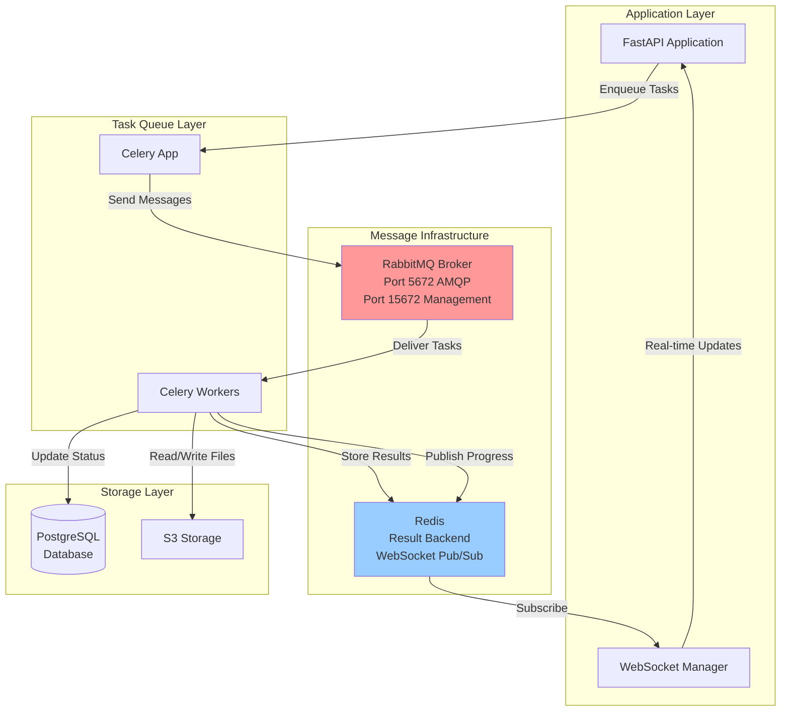

# Design Document: RabbitMQ Broker Migration

## Overview

This design specifies the migration of the document processing system's Celery task queue from Redis to RabbitMQ as the message broker. The migration addresses reliability concerns by leveraging RabbitMQ's superior message durability, persistence guarantees, and task acknowledgment mechanisms. Redis will be retained for its current roles: storing Celery task results (result backend) and managing WebSocket pub/sub for real-time progress updates.

### Goals

1. Replace Redis with RabbitMQ as the Celery message broker
2. Maintain Redis for result backend and WebSocket pub/sub functionality
3. Enable message persistence to survive broker restarts
4. Implement reliable task acknowledgment and requeuing
5. Preserve all existing task definitions and behavior
6. Maintain or improve system performance and throughput

### Non-Goals

1. Migrating the result backend from Redis to another system
2. Changing task serialization formats or task signatures
3. Modifying WebSocket pub/sub implementation
4. Implementing custom message routing beyond Celery defaults
5. Building a custom message broker abstraction layer

## Architecture

### System Components

### Message Flow

